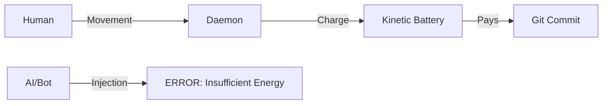

# Git-Gov: Proof of Human Work (PoHW) 🦾⛓️

> **"Information must be paid for with energy. No commit without sweat."**

Git-Gov is a sovereign governance system for Git repositories that implements the **First Law of Software Thermodynamics**. Its mission is to eradicate "Bio-Puppetry" (using humans as mere signers for AI-generated code) through an invisible and mathematically incorruptible kinematic validation system.

## 🌌 The Shadow Philosophy

In the age of generative AI, code is cheap, but **human attention** is the scarcest and most valuable resource. Git-Gov acts as a "shadow" that monitors your biomechanical effort (mouse movement, focus time) and converts it into **Attention Credits**.

Without these credits, the repository simply denies entry. It is the end of "Code Dumping."

---

## ⚙️ Thermodynamic Architecture

Git-Gov operates under a closed energy cycle:

1.  **Kinematic Capture**: The Daemon (`git-gov-daemon`) captures the entropy of your physical movements.
2.  **Kinetic Battery**: Your effort charges a virtual battery. If the movement is mechanical (scripts/jigglers), the battery will not charge due to **Low NCD Entropy**.
3.  **Entropic Cost**: Every line of code you write has a cost based on its information density.
4.  **Git Customs**: When performing a `git commit`, the system verifies if you have enough "energy" to pay for the complexity of your changes.



---

## 🛡️ Elite Features

*   **Spoof-Immune**: Requires real hardware events captured at the kernel level (**Causality Validation**).
*   **Metabolic Balance**: The system knows a human cannot curate 1,000 lines of dense code in 1 minute.
*   **Total Privacy**: No coordinates or content are recorded. Only statistical entropy is processed locally.
*   **Mathematically Integrity**: Validated via **Property-Based Testing** (`proptest`) against thousands of attack scenarios.

---

## 🚀 Elite Installation (Linux)

For a formal and global installation on your system:

```bash
git clone https://github.com/iodevs-net/git-gov.git
cd git-gov
make install
```
*This command compiles the project and deploys the `git-gov` and `git-gov-daemon` binaries to `/usr/local/bin`.*

---

## 🚀 Deploying the Customs

### 1. Start the Sentinel
To start accumulating energy in the background:
```bash
git-gov on
```
*Use `git-gov off` to stop it at any time.*

### 2. Activate Sovereignty
In your repository, initialize the thermodynamic customs:
```bash
git-gov init
```
*This will automatically install the `pre-commit` and `prepare-commit-msg` hooks that physically block the flow if the energy balance is negative.*

### 3. Check Your Reserves
How much attention energy do you have left?
```bash
git-gov status   # To check if it's running
git-gov metrics  # To see your kinetic energy
```

---

## � Security & FAQ

### How does it prevent "Mouse Jigglers" or Scripts?
Bots generate predictable patterns. Git-Gov uses **Normalized Compression Distance (NCD)** to measure movement entropy. If the pattern is mechanical, the battery will not charge. A script would have to simulate human physiology perfectly, which is nearly as difficult as writing the code yourself.

### Can I hack memory to get infinite energy?
No. The Daemon implements **Causality Validation**. The system cross-references the energy level with real hardware event counts from the kernel (`/dev/input`). If your energy rises without physical movement reported by the driver, the system detects an anomaly and blocks ticket issuance.

### Is it private? Am I being spied on?
Absolutely. Git-Gov **does not record coordinates or content**. It only processes speed deltas statistically. Data dies in a circular RAM buffer every 5 seconds and is never written to disk or sent over the network.

### What happens if someone deletes the Git Hook?
Locally, a user could try to evade it. However, in a professional environment, the remote server (Oracle) rejects any commit that doesn't include the **Ed25519 Signed Trailer** generated by a legitimate Daemon.

---

## �📂 Project Anatomy

- `git-gov-core`: The entropy, thermodynamics, and hardware validation engine.
- `git-gov-cli`: Your interface with the customs and cryptographic identity management.
- `git-gov-daemon`: The invisible sentinel living in the background.

---

## 🔮 Future Roadmap: v2.0 "The All-Seeing Eye"

### The Challenge: "Proof of Focus"
In v1.0, Git-Gov validates **"Proof of Human Presence."** If you game intensely, you generate valid entropy to commit. This is "working as intended" to prevent bot farms, but it doesn't guarantee you were coding.

### The Goal: v2.0
Implement **"Proof of Focus"**: Energy only charges when the active window is an IDE or Terminal.

**Why do we need help?**
Linux fragmentation (X11 vs Wayland) makes active window detection a monumental compatibility challenge.
- **X11**: Trivial (`xprop`).
- **Wayland**: Complex (requires specific Compositor support or Portals).

We are looking for Rust + Linux Desktop API experts to build the Daemon's vision layer!

---

## 🏛️ The Verdict of Inertia

Git-Gov does not ban AI. It **regulates it thermodynamically**. If you use AI to generate code, you must spend enough time curating, reading, and refining it to charge the battery needed to upload it.

**If there is no sweat, there is no commit.**

---
*Guaranteeing human sovereignty at the bit frontier.*
