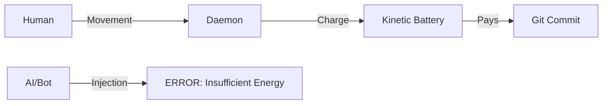

# Git-Gov: Proof of Human Work (PoHW) 🦾⛓️

> **"Information must be paid for with energy. No commit without sweat."**

Git-Gov is a sovereign governance system for Git repositories that implements the **First Law of Software Thermodynamics**. Its mission is to eradicate "Bio-Puppetry" (using humans as mere signers for AI-generated code) through an invisible and mathematically incorruptible kinematic validation system.

## 🌌 The Shadow Philosophy

In the age of generative AI, code is cheap, but **human attention** is the scarcest and most valuable resource. Git-Gov acts as a "shadow" that monitors your biomechanical effort (mouse movement, focus time) and converts it into **Attention Credits**.

Without these credits, the repository simply denies entry. It is the end of "Code Dumping."

---

## ⚙️ Thermodynamic Architecture

Git-Gov operates under a closed energy cycle:

1.  **Kinematic Capture**: The Daemon (`git-gov-daemon`) captures the entropy of your physical movements.
2.  **Kinetic Battery**: Your effort charges a virtual battery. If the movement is mechanical (scripts/jigglers), the battery will not charge due to **Low NCD Entropy**.
3.  **Entropic Cost**: Every line of code you write has a cost based on its information density.
4.  **Git Customs**: When performing a `git commit`, the system verifies if you have enough "energy" to pay for the complexity of your changes.



---

## 🛡️ Elite Features

*   **Spoof-Immune**: Requires real hardware events captured at the kernel level (**Causality Validation**).
*   **Metabolic Balance**: The system knows a human cannot curate 1,000 lines of dense code in 1 minute.
*   **Total Privacy**: No coordinates or content are recorded. Only statistical entropy is processed locally.
*   **Mathematically Integrity**: Validated via **Property-Based Testing** (`proptest`) against thousands of attack scenarios.

---

## 🚀 Deploying the Customs

### 1. Start the Sentinel
The daemon must be running to accumulate your energy as you work:
```bash
git-gov daemon
```

### 2. Activate Sovereignty
In your repository, initialize the thermodynamic customs:
```bash
git-gov init
```
*This will automatically install the `pre-commit` and `prepare-commit-msg` hooks that physically block the flow if the energy balance is negative.*

### 3. Check Your Reserves
How much attention energy do you have left?
```bash
git-gov metrics
```

---

## 📂 Project Anatomy

- `git-gov-core`: The entropy, thermodynamics, and hardware validation engine.
- `git-gov-cli`: Your interface with the customs and cryptographic identity management.
- `git-gov-daemon`: The invisible sentinel living in the background.

---

## 🏛️ The Verdict of Inertia

Git-Gov does not ban AI. It **regulates it thermodynamically**. If you use AI to generate code, you must spend enough time curating, reading, and refining it to charge the battery needed to upload it.

**If there is no sweat, there is no commit.**

---
*Guaranteeing human sovereignty at the bit frontier.*
