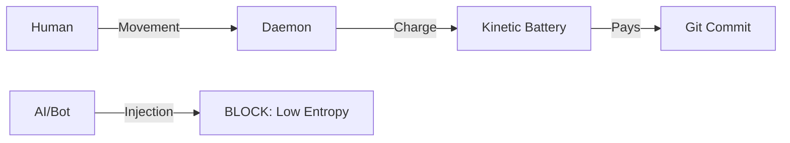

# Cliff-Watch: Sovereign Governance & Proof of Focus 🛡️🧠

> **"Information must be paid for with energy. No commit without sweat."**

**Cliff-Watch** is an open standard and a high-performance toolset designed to certify **human attention** in software development. In an era of Generative AI, where code is cheap but focus is scarce, Cliff-Watch implements the **First Law of Software Thermodynamics**: every bit of code must be backed by biometrical effort.

---

## 🌪️ The Entropy Crisis

The mass adoption of LLMs has created a new challenge for maintainers:
1. **High-Velocity AI Sludge:** PRs generated in milliseconds without human oversight.
2. **Illusion of Craftsmanship:** Correct-looking but logically fragile code.
3. **Bio-Puppetry:** Humans acting as mere signers for bot-generated output.

**Cliff-Watch doesn't analyze the text; it validates the process.**

---

## 🛡️ Sovereign Features (v4.1)

### 1. Proof of Focus (PoF)
A background sentinel (`cliff-watch-daemon`) monitors your kinematic activity (mouse/keyboard patterns) using **Normalized Compression Distance (NCD)** to ensure the presence is biological, not scripted.

### 2. Linked Sovereignty (New!)
Focus credits only accumulate when you are working on technically validated files. Editing "noise" or "garbage" files doesn't inflate your Human Score.

### 3. Qualitative Humanized Metrics
Goodbye to raw fractional numbers. Cliff-Watch speaks the language of artisans:
*   **Very Low / Low:** Insufficient Presence.
*   **Medium:** Progressing, but lacks depth.
*   **High / Very High:** Sovereign level. Commit certified.

### 4. 360° Repository Audit
Every time a commit is blocked, you get a full snapshot of your workspace:
*   **STAGED COMPONENTS:** What's ready to go.
*   **UNSTAGED MODIFICATIONS:** Pending revisions.
*   **UNTRACKED ARCHIVES:** New detected noise.

---

## 🚀 Sovereign Setup (Lean Orchestration)

Cliff-Watch is built in **Rust** for maximum performance and follows **Lean, DRY, and SOLID** principles.

### Installation
```bash
git clone https://github.com/iodevs-net/git-gov.git
cd git-gov
make install  # Compiles in release and deploys to /usr/local/bin
```

### Initialization
```bash
cliff-watch init  # Installs the thermodynamic customs in your repo
```

### Automation (Makefile)
*   `make bootstrap`: Seeding the sentinel.
*   `make build`: Native compilation.
*   `make test`: Integrity validation.
*   `make clean`: Purging artifacts and local cache.

---

## 🏛️ Architecture & Privacy

Designed with a **Local-First** philosophy:
*   ✅ **No Root Required:** Operates entirely in user space.
*   ✅ **No Keylogging:** We process speed deltas and entropy, not content.
*   ✅ **Causality Validation:** Hardware events are cross-referenced with energy levels.



---

## 🤝 Join the Frontier

We are building a future where AI assists, but **Humans Certify**.
*   **Core:** Rust engine for linux desktop stability.
*   **Witness:** VS Code / JetBrains extensions for IDE level focus capture.

*Guaranteeing human sovereignty at the bit frontier.* 🐈🛡️✨