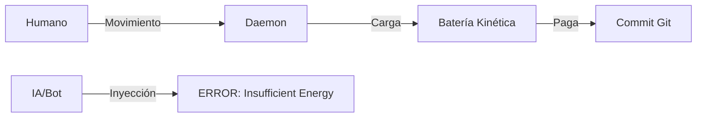

# Git-Gov: Proof of Human Work (PoHW) 🦾⛓️

> **"La información debe ser pagada con energía. No hay commit sin sudor."**

Git-Gov es un sistema de gobernanza soberana para repositorios Git que implementa la **Primera Ley de la Termodinámica del Software**. Su misión es erradicar la "Bio-Puppetry" (el uso de humanos como simples firmadores de código de IA) mediante un sistema de validación cinemática invisible y matemáticamente incorruptible.

## 🌌 La Filosofía de la Sombra

En la era de la IA generativa, el código es barato, pero la **atención humana** es el recurso más escaso y valioso. Git-Gov actúa como una "sombra" que monitorea tu esfuerzo biomecánico (mouse, tiempo de enfoque) y lo convierte en **Créditos de Atención**.

Sin estos créditos, el repositorio simplemente te deniega la entrada. Es el fin del "Code Dumping".

---

## ⚙️ Arquitectura Termodinámica

Git-Gov opera bajo un ciclo de energía cerrado:

1.  **Captura Kinética**: El Daemon (`git-gov-daemon`) captura la entropía de tus movimientos físicos.
2.  **Batería de Atención**: Tu esfuerzo carga una batería virtual. Si el movimiento es mecánico (scripts/jigglers), la batería no carga debido a la **Baja Entropía de NCD**.
3.  **Costo Entrópico**: Cada línea de código que escribes tiene un costo basado en su densidad de información. 
4.  **Aduana de Git**: Al hacer `git commit`, el sistema verifica si tienes suficiente "energía" para pagar la complejidad de tus cambios.



---

## 🛡️ Características de Élite

*   **Inmune al Spoofing**: Requiere eventos de hardware reales capturados a nivel de kernel (**Validación de Causalidad**).
*   **Balance Metabólico**: El sistema sabe que un humano no puede curar 1,000 líneas de código denso en 1 minuto.
*   **Privacidad Total**: No se graban coordenadas ni contenido. Solo se procesa la entropía estadística localmente.
*   **Matemáticamente Íntegro**: Validado mediante **Property-Based Testing** (`proptest`) contra miles de escenarios de ataque.

---

## 🚀 Instalación Élite (Linux)

Para una instalación formal y global en tu sistema:

```bash
git clone https://github.com/iodevs-net/git-gov.git
cd git-gov
make install
```
*Este comando compila el proyecto y despliega los binarios `git-gov` y `git-gov-daemon` en `/usr/local/bin`.*

---

## 🚀 Despliegue de la Aduana

### 1. Iniciar el Centinela
Para que el sistema empiece a acumular tu energía en background:
```bash
git-gov on
```
*Usa `git-gov off` para detenerlo en cualquier momento.*

### 2. Activar la Soberanía
En tu repositorio, inicializa la aduana termodinámica:
```bash
git-gov init
```
*Esto instalará los hooks de `pre-commit` y `prepare-commit-msg` que bloquean físicamente el flujo si el balance de energía es negativo.*

### 3. Consultar tu Reserva
¿Cuánta energía de atención te queda?
```bash
git-gov status   # Para ver si está corriendo
git-gov metrics  # Para ver tu energía kinética
```

---

## 🔒 Seguridad y FAQ

### ¿Cómo evita los "Mouse Jigglers" o Scripts?
Los bots generan patrones predecibles. Git-Gov utiliza **Distancia de Compresión Normalizada (NCD)** para medir la entropía del movimiento. Si el patrón es mecánico, la batería no carga. Un script tendría que simular la fisiología humana a la perfección, lo cual es casi tan difícil como escribir el código uno mismo.

### ¿Puedo hackear la memoria para darme energía infinita?
No. El Daemon implementa **Validación de Causalidad**. El sistema cruza el nivel de energía con el conteo de eventos de hardware reales del kernel (`/dev/input`). Si tu energía sube sin movimiento físico reportado por el driver, el sistema detecta una anomalía y bloquea la emisión de tickets.

### ¿Es privado? ¿Me están espiando?
Totalmente. Git-Gov **no graba coordenadas ni contenido**. Solo procesa deltas de velocidad de forma estadística. Los datos mueren en un buffer circular en RAM cada 5 segundos y nunca se escriben en disco ni se envían a la red.

### ¿Qué pasa si alguien borra el Hook de Git?
Localmente, un usuario podría intentar evadirlo. Sin embargo, en un entorno profesional, el servidor remoto (Oráculo) rechaza cualquier commit que no incluya el **Trailer Firmado con Ed25519** generado por un Daemon legítimo.

---

## 📂 Anatomía del Proyecto

- `git-gov-core`: El motor de entropía, termodinámica y validación de hardware.
- `git-gov-cli`: Tu interfaz con la aduana y gestión de identidad criptográfica.
- `git-gov-daemon`: El centinela invisible que habita en el background.

---

## 🏛️ El Veredicto de la Inercia

Git-Gov no prohíbe la IA. La **regula termodinámicamente**. Si usas IA para generar código, debes pasar el tiempo suficiente curándolo, leyéndolo y refinándolo para cargar la batería necesaria para subirlo. 

**Si no hay sudor, no hay commit.**

---
*Garantizando la soberanía humana en la frontera del bit.*
