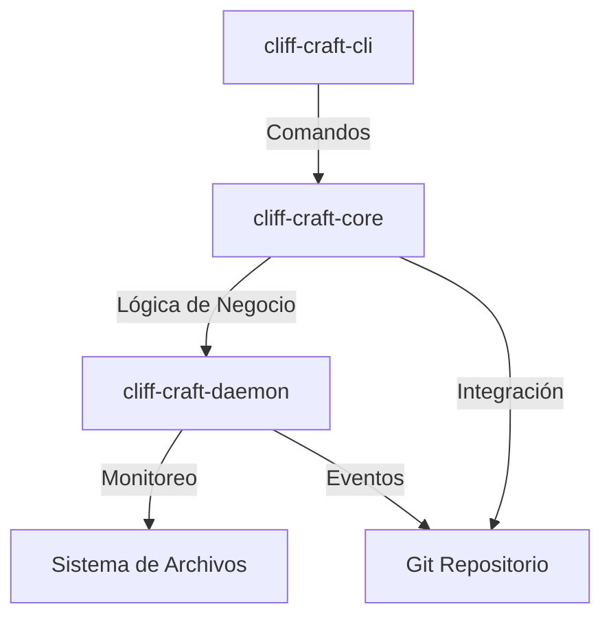
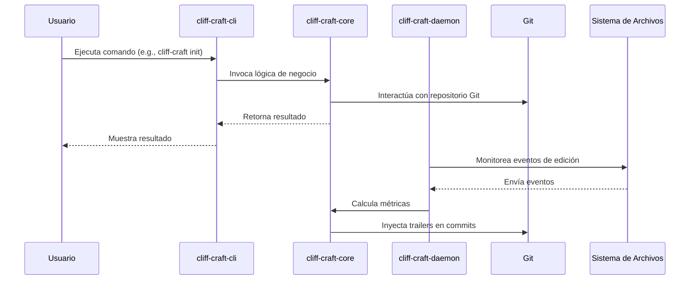
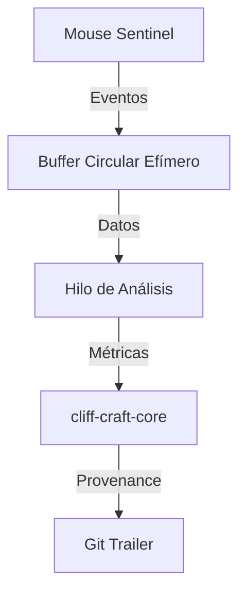

# Arquitectura del Sistema cliff-craft

## 1. Introducción
Este documento detalla la arquitectura del sistema cliff-craft, incluyendo diagramas de componentes, interacciones entre módulos y diseño de la solución.

## 2. Visión General de la Arquitectura

### 2.1 Componentes Principales
El sistema cliff-craft se compone de tres módulos principales:

1. **cliff-craft-core**: Lógica central para el cálculo de métricas y criptografía.
2. **cliff-craft-cli**: Interfaz de línea de comandos para interactuar con el sistema.
3. **cliff-craft-daemon**: Proceso en segundo plano que monitorea la actividad de edición.

### 2.2 Diagrama de Arquitectura



## 3. Diseño de Módulos

### 3.1 cliff-craft-core

#### 3.1.1 Responsabilidades
- Cálculo de métricas de entropía y burstiness.
- Generación y verificación de firmas criptográficas.
- Integración con repositorios Git.
- Serialización de metadatos de procedencia.

#### 3.1.2 Submódulos

##### 3.1.2.1 crypto.rs
- **Responsabilidad**: Manejo de firmas digitales utilizando Ed25519.
- **Dependencias**: `ed25519-dalek`, `rand`.
- **Funciones Principales**:
  - Generación de claves.
  - Firma de metadatos.
  - Verificación de firmas.

##### 3.1.2.2 entropy.rs
- **Responsabilidad**: Cálculo de métricas de entropía y compresión.
- **Dependencias**: `zstd`, `statrs`.
- **Funciones Principales**:
  - Cálculo de Normalized Compression Distance (NCD).
  - Análisis de distribución de tokens.
  - Cálculo de entropía de Shannon.

##### 3.1.2.3 git.rs
- **Responsabilidad**: Interacción con repositorios Git.
- **Dependencias**: `git2`.
- **Funciones Principales**:
  - Lectura de commits y árboles.
  - Inyección de trailers en commits.
  - Cálculo de hashes de árboles.

##### 3.1.2.4 monitor.rs
- **Responsabilidad**: Monitoreo de eventos de edición.
- **Dependencias**: `notify`.
- **Funciones Principales**:
  - Captura de eventos de sistema de archivos.
  - Agregación de eventos en epochs.
  - Cálculo de métricas de burstiness.

##### 3.1.2.5 provenance.rs
- **Responsabilidad**: Manejo de metadatos de procedencia.
- **Dependencias**: `serde`, `serde_json`, `chrono`.
- **Funciones Principales**:
  - Generación de manifiestos de procedencia.
  - Serialización y deserialización de metadatos.
  - Validación de estructura de datos.

##### 3.1.2.6 stats.rs
- **Responsabilidad**: Análisis estadístico.
- **Dependencias**: `statrs`.
- **Funciones Principales**:
  - Cálculo de media y desviación estándar.
  - Análisis de distribuciones.
  - Cálculo de métricas de burstiness.

### 3.2 cliff-craft-cli

#### 3.2.1 Responsabilidades
- Proporcionar una interfaz de línea de comandos para interactuar con cliff-craft.
- Ejecutar comandos como `init`, `verify`, `daemon`, y `SystemCheck`.
- Manejo de argumentos y opciones de línea de comandos.

#### 3.2.2 Submódulos

##### 3.2.2.1 main.rs
- **Responsabilidad**: Punto de entrada de la CLI.
- **Dependencias**: `clap`, `cliff-craft-core`.
- **Funciones Principales**:
  - Parsing de argumentos.
  - Ejecución de comandos.
  - Manejo de errores y salida.

##### 3.2.2.2 commands/
- **Responsabilidad**: Implementación de subcomandos.
- **Dependencias**: `clap`, `cliff-craft-core`, `anyhow`.
- **Funciones Principales**:
  - Implementación de `init`.
  - Implementación de `verify`.
  - Implementación de `daemon`.
  - Implementación de `SystemCheck`.

### 3.3 cliff-craft-daemon

#### 3.3.1 Responsabilidades
- Ejecutar como un proceso en segundo plano.
- Monitorear eventos de edición en tiempo real.
- Calcular métricas de actividad.
- Comunicarse con cliff-craft-core para generar metadatos de procedencia.

#### 3.3.2 Submódulos

##### 3.3.2.1 main.rs
- **Responsabilidad**: Punto de entrada del daemon.
- **Dependencias**: `cliff-craft-core`, `ctrlc`.
- **Funciones Principales**:
  - Inicialización del daemon.
  - Manejo de señales de interrupción.
  - Cierre elegante.

##### 3.3.2.2 ipc.rs
- **Responsabilidad**: Comunicación inter-procesos.
- **Dependencias**: `cliff-craft-core`.
- **Funciones Principales**:
  - Manejo de sockets de dominio Unix (macOS/Linux).
  - Manejo de named pipes (Windows).
  - Comunicación con git hooks.

## 4. Interacciones entre Módulos

### 4.1 Flujo de Datos



### 4.2 Comunicación entre Procesos
El daemon y la CLI se comunican mediante sockets de dominio Unix en macOS/Linux y named pipes en Windows. Esto permite:
- Consulta de métricas en tiempo real.
- Inyección de metadatos en commits.
- Sincronización de estado.

## 5. Diseño del Mouse Sentinel

### 5.1 Arquitectura
El Mouse Sentinel es un módulo de telemetría cinemática diseñado para distinguir entre movimientos humanos y sintéticos del ratón.



### 5.2 Componentes

#### 5.2.1 Captura de Eventos
- **Windows**: Utiliza `SetWindowsHookEx` mediante `rdev`.
- **macOS**: Utiliza `CGEventTap` mediante `rdev`.
- **Linux**: Utiliza `evdev` para acceso directo al kernel.

#### 5.2.2 Buffer Circular Efímero
- **Capacidad**: 2048 muestras (aproximadamente 10-20 segundos de datos).
- **Ubicación**: Memoria RAM (Heap).
- **Política de Retención**: Los datos se sobrescriben después del análisis.

#### 5.2.3 Hilo de Análisis
- **Responsabilidades**:
  - Cálculo de métricas cinemáticas.
  - Destrucción de datos sensibles.
  - Generación de características abstractas.

#### 5.2.4 Métricas Cinemáticas
- **Log Dimensionless Jerk (LDLJ)**: Mide la suavidad del movimiento.
- **Entropía Espectral**: Mide la complejidad frecuencial.
- **Entropía Angular**: Mide la variabilidad de curvatura.
- **Throughput**: Mide la relación velocidad/precisión.

## 6. Integración con Git

### 6.1 Git Trailers
Los metadatos de procedencia se almacenan como trailers en los commits de Git. Esto asegura:
- **Inmutabilidad**: Los trailers son parte del contenido del commit.
- **Integridad**: Cambiar un trailer cambia el hash del commit.
- **Compatibilidad**: Los trailers son compatibles con todas las versiones de Git.

### 6.2 Ejemplo de Trailer
```git
commit abc123...
Author: John Doe <john@example.com>
Date:   Mon Jan 1 00:00:00 2024 +0000

    Implement feature X

    .code-provenance: {"version":"1.0","pohw":{"kinematics":{"ldlj":-6.42,"spec_entropy":0.78,"path_entropy":2.31,"throughput":4.5}}}
```

## 7. Validación de Arquitectura

### 7.1 Revisión con Stakeholders
- **Objetivo**: Validar la arquitectura con el equipo y stakeholders.
- **Método**: Sesiones de revisión y feedback.
- **Resultado**: Ajustes y mejoras basados en feedback.

### 7.2 Pruebas de Concepto
- **Objetivo**: Validar la viabilidad de la arquitectura.
- **Método**: Implementación de prototipos y pruebas de integración.
- **Resultado**: Confirmación de la arquitectura y ajustes necesarios.

## 8. Conclusión
Este documento detalla la arquitectura del sistema cliff-craft, asegurando que el diseño cumpla con los principios DRY, LEAN y SOLID. La arquitectura propuesta proporciona una base sólida para la implementación del sistema, garantizando la estabilidad, seguridad y eficiencia del mismo.