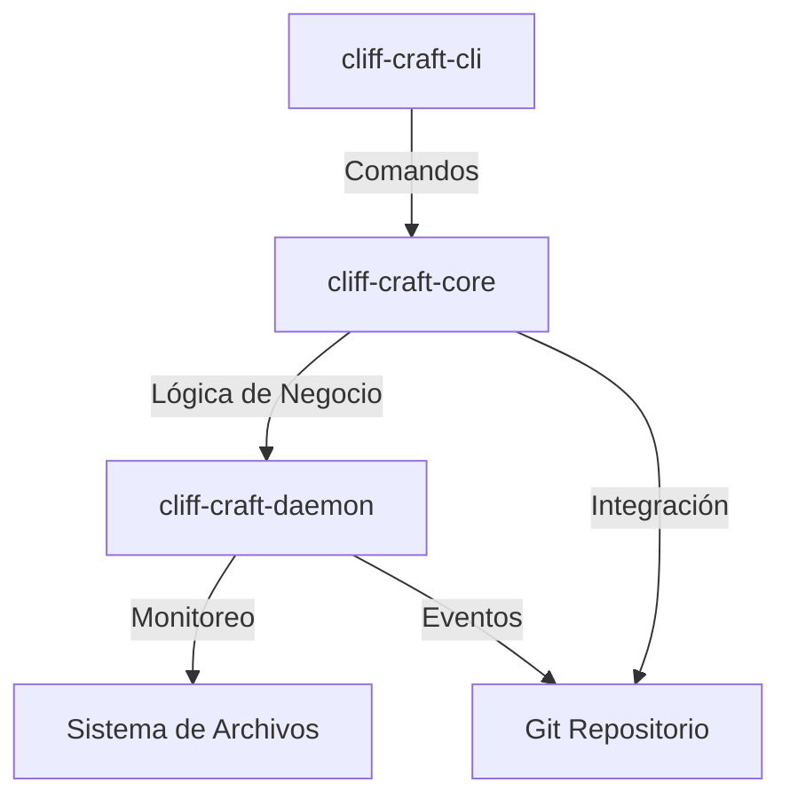

# Definición de Módulos para cliff-craft

## 1. Introducción
Este documento define los módulos principales del sistema cliff-craft, sus responsabilidades y las interacciones entre ellos, asegurando la adherencia a los principios DRY, LEAN y SOLID.

## 2. Módulos Principales

### 2.1 cliff-craft-core

#### 2.1.1 Descripción
El módulo `cliff-craft-core` contiene la lógica central del sistema, incluyendo el cálculo de métricas, criptografía, integración con Git y manejo de metadatos de procedencia.

#### 2.1.2 Responsabilidades
- Cálculo de métricas de entropía y burstiness.
- Generación y verificación de firmas criptográficas.
- Integración con repositorios Git.
- Serialización de metadatos de procedencia.

#### 2.1.3 Submódulos

##### 2.1.3.1 crypto
- **Descripción**: Manejo de firmas digitales utilizando Ed25519.
- **Dependencias**: `ed25519-dalek`, `rand`.
- **Funciones Principales**:
  - Generación de claves.
  - Firma de metadatos.
  - Verificación de firmas.

##### 2.1.3.2 entropy
- **Descripción**: Cálculo de métricas de entropía y compresión.
- **Dependencias**: `zstd`, `statrs`.
- **Funciones Principales**:
  - Cálculo de Normalized Compression Distance (NCD).
  - Análisis de distribución de tokens.
  - Cálculo de entropía de Shannon.

##### 2.1.3.3 git
- **Descripción**: Interacción con repositorios Git.
- **Dependencias**: `git2`.
- **Funciones Principales**:
  - Lectura de commits y árboles.
  - Inyección de trailers en commits.
  - Cálculo de hashes de árboles.

##### 2.1.3.4 monitor
- **Descripción**: Monitoreo de eventos de edición.
- **Dependencias**: `notify`.
- **Funciones Principales**:
  - Captura de eventos de sistema de archivos.
  - Agregación de eventos en epochs.
  - Cálculo de métricas de burstiness.

##### 2.1.3.5 provenance
- **Descripción**: Manejo de metadatos de procedencia.
- **Dependencias**: `serde`, `serde_json`, `chrono`.
- **Funciones Principales**:
  - Generación de manifiestos de procedencia.
  - Serialización y deserialización de metadatos.
  - Validación de estructura de datos.

##### 2.1.3.6 stats
- **Descripción**: Análisis estadístico.
- **Dependencias**: `statrs`.
- **Funciones Principales**:
  - Cálculo de media y desviación estándar.
  - Análisis de distribuciones.
  - Cálculo de métricas de burstiness.

### 2.2 cliff-craft-cli

#### 2.2.1 Descripción
El módulo `cliff-craft-cli` proporciona una interfaz de línea de comandos para interactuar con el sistema cliff-craft.

#### 2.2.2 Responsabilidades
- Proporcionar una interfaz de línea de comandos para interactuar con cliff-craft.
- Ejecutar comandos como `init`, `verify`, `daemon`, y `SystemCheck`.
- Manejo de argumentos y opciones de línea de comandos.

#### 2.2.3 Submódulos

##### 2.2.3.1 main.rs
- **Descripción**: Punto de entrada de la CLI.
- **Dependencias**: `clap`, `cliff-craft-core`.
- **Funciones Principales**:
  - Parsing de argumentos.
  - Ejecución de comandos.
  - Manejo de errores y salida.

##### 2.2.3.2 commands/
- **Descripción**: Implementación de subcomandos.
- **Dependencias**: `clap`, `cliff-craft-core`, `anyhow`.
- **Funciones Principales**:
  - Implementación de `init`.
  - Implementación de `verify`.
  - Implementación de `daemon`.
  - Implementación de `SystemCheck`.

### 2.3 cliff-craft-daemon

#### 2.3.1 Descripción
El módulo `cliff-craft-daemon` ejecuta como un proceso en segundo plano, monitoreando eventos de edición en tiempo real y calculando métricas de actividad.

#### 2.3.2 Responsabilidades
- Ejecutar como un proceso en segundo plano.
- Monitorear eventos de edición en tiempo real.
- Calcular métricas de actividad.
- Comunicarse con cliff-craft-core para generar metadatos de procedencia.

#### 2.3.3 Submódulos

##### 2.3.3.1 main.rs
- **Descripción**: Punto de entrada del daemon.
- **Dependencias**: `cliff-craft-core`, `ctrlc`.
- **Funciones Principales**:
  - Inicialización del daemon.
  - Manejo de señales de interrupción.
  - Cierre elegante.

##### 2.3.3.2 ipc.rs
- **Descripción**: Comunicación inter-procesos.
- **Dependencias**: `cliff-craft-core`.
- **Funciones Principales**:
  - Manejo de sockets de dominio Unix (macOS/Linux).
  - Manejo de named pipes (Windows).
  - Comunicación con git hooks.

## 3. Tabla de Responsabilidades por Módulo

| Módulo | Responsabilidad | Dependencias |
|--------|----------------|--------------|
| crypto | Manejo de firmas digitales | ed25519-dalek, rand |
| entropy | Cálculo de métricas de entropía | zstd, statrs |
| git | Interacción con Git | git2 |
| monitor | Monitoreo de eventos | notify |
| provenance | Manejo de metadatos | serde, serde_json, chrono |
| stats | Análisis estadístico | statrs |
| main.rs (CLI) | Punto de entrada CLI | clap, cliff-craft-core |
| commands/ (CLI) | Implementación de comandos | clap, cliff-craft-core, anyhow |
| main.rs (Daemon) | Punto de entrada Daemon | cliff-craft-core, ctrlc |
| ipc.rs (Daemon) | Comunicación inter-procesos | cliff-craft-core |

## 4. Interacciones entre Módulos

### 4.1 Diagrama de Interacción

### 4.2 Flujo de Datos

1. **Usuario → CLI**: El usuario ejecuta un comando mediante la CLI.
2. **CLI → Core**: La CLI invoca la lógica de negocio en el core.
3. **Core → Git**: El core interactúa con el repositorio Git.
4. **Core → CLI**: El core retorna el resultado a la CLI.
5. **CLI → Usuario**: La CLI muestra el resultado al usuario.

### 4.3 Comunicación entre Procesos
El daemon y la CLI se comunican mediante sockets de dominio Unix en macOS/Linux y named pipes en Windows. Esto permite:
- Consulta de métricas en tiempo real.
- Inyección de metadatos en commits.
- Sincronización de estado.

## 5. Principios de Diseño

### 5.1 DRY (Don't Repeat Yourself)
- **Implementación**: La lógica de negocio se centraliza en `cliff-craft-core`, evitando la duplicación de código.
- **Beneficio**: Reduce la redundancia y facilita el mantenimiento.

### 5.2 LEAN (Optimización para Hardware de Bajos Recursos)
- **Implementación**: Uso de perfiles de compilación agresivos (`opt-level = "z"`, `lto = true`).
- **Beneficio**: Optimiza el tamaño del binario y el consumo de recursos.

### 5.3 SOLID (Separación de Concerns)
- **Implementación**: Cada módulo tiene una responsabilidad única y bien definida.
- **Beneficio**: Facilita la modularidad y la escalabilidad.

## 6. Validación de Arquitectura

### 6.1 Revisión con Stakeholders
- **Objetivo**: Validar la arquitectura con el equipo y stakeholders.
- **Método**: Sesiones de revisión y feedback.
- **Resultado**: Ajustes y mejoras basados en feedback.

### 6.2 Pruebas de Concepto
- **Objetivo**: Validar la viabilidad de la arquitectura.
- **Método**: Implementación de prototipos y pruebas de integración.
- **Resultado**: Confirmación de la arquitectura y ajustes necesarios.

## 7. Conclusión
Este documento define los módulos principales del sistema cliff-craft, sus responsabilidades y las interacciones entre ellos, asegurando la adherencia a los principios DRY, LEAN y SOLID. La arquitectura propuesta proporciona una base sólida para la implementación del sistema, garantizando la estabilidad, seguridad y eficiencia del mismo.