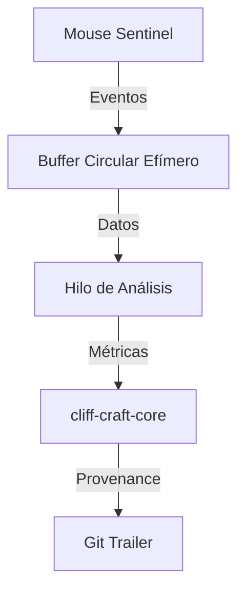

# Diseño del Mouse Sentinel para cliff-craft

## 1. Introducción
Este documento detalla el diseño técnico del módulo Mouse Sentinel, un componente crítico de cliff-craft que implementa telemetría cinemática para distinguir entre movimientos humanos y sintéticos del ratón.

## 2. Visión General

### 2.1 Objetivo
El Mouse Sentinel tiene como objetivo transformar el ratón en un oráculo criptográfico de alta fidelidad, capaz de distinguir entre la interpolación algorítmica de un bot y el control motor biológico de un ser humano.

### 2.2 Principios de Diseño
- **Privacidad por Diseño**: Procesar coordenadas absolutas exclusivamente en memoria volátil.
- **Precisión**: Utilizar algoritmos basados en la física del movimiento humano.
- **Compatibilidad**: Soporte para múltiples sistemas operativos (Windows, macOS, Linux).

## 3. Arquitectura del Mouse Sentinel

### 3.1 Diagrama de Arquitectura



### 3.2 Componentes Principales

#### 3.2.1 Captura de Eventos
- **Descripción**: Captura de eventos de movimiento del ratón en tiempo real.
- **Implementación**:
  - **Windows**: Utiliza `SetWindowsHookEx` mediante `rdev`.
  - **macOS**: Utiliza `CGEventTap` mediante `rdev`.
  - **Linux**: Utiliza `evdev` para acceso directo al kernel.

#### 3.2.2 Buffer Circular Efímero
- **Descripción**: Almacenamiento temporal de eventos de entrada.
- **Capacidad**: 2048 muestras (aproximadamente 10-20 segundos de datos).
- **Ubicación**: Memoria RAM (Heap).
- **Política de Retención**: Los datos se sobrescriben después del análisis.

#### 3.2.3 Hilo de Análisis
- **Descripción**: Procesamiento de eventos y cálculo de métricas cinemáticas.
- **Responsabilidades**:
  - Cálculo de métricas cinemáticas.
  - Destrucción de datos sensibles.
  - Generación de características abstractas.

#### 3.2.4 Métricas Cinemáticas
- **Log Dimensionless Jerk (LDLJ)**: Mide la suavidad del movimiento.
- **Entropía Espectral**: Mide la complejidad frecuencial.
- **Entropía Angular**: Mide la variabilidad de curvatura.
- **Throughput**: Mide la relación velocidad/precisión.

## 4. Algoritmos Matemáticos

### 4.1 Log Dimensionless Jerk (LDLJ)

#### 4.1.1 Descripción
El LDLJ mide la suavidad del movimiento, normalizando la métrica contra la amplitud y duración del movimiento.

#### 4.1.2 Fórmula
$$LDLJ = - \ln \left( \frac{\int_{t_{start}}^{t_{end}} |J(t)|^2 dt \cdot D^3}{v_{peak}^2} \right)$$

#### 4.1.3 Implementación
```rust
fn calculate_ldlj(jerk_samples: &[f64], duration: f64, peak_velocity: f64) -> f64 {
    let integral: f64 = jerk_samples.iter().map(|&j| j.powi(2)).sum();
    let ldlj = -((integral * duration.powi(3)) / peak_velocity.powi(2)).ln();
    ldlj
}
```

### 4.2 Entropía Espectral

#### 4.2.1 Descripción
La entropía espectral mide la complejidad frecuencial del movimiento, utilizando la Transformada Rápida de Fourier (FFT).

#### 4.2.2 Fórmula
$$H_{spec} = - \sum_{f} P(f) \log_2 P(f)$$

#### 4.2.3 Implementación
```rust
use rustfft::{FftPlanner, num_complex::Complex};

fn calculate_spectral_entropy(velocity_samples: &[f64], target_fs: f64) -> f64 {
    let resampled = resample_linear(velocity_samples, target_fs);
    let windowed: Vec<f64> = resampled.iter().enumerate()
        .map(|(i, v)| v * 0.5 * (1.0 - (2.0 * std::f64::consts::PI * i as f64 / (resampled.len() - 1) as f64).cos()))
        .collect();

    let mut planner = FftPlanner::new();
    let fft = planner.plan_fft_forward(windowed.len());
    let mut buffer: Vec<Complex<f64>> = windowed.iter().map(|&x| Complex::new(x, 0.0)).collect();
    fft.process(&mut buffer);

    let power_spectrum: Vec<f64> = buffer.iter().map(|c| c.norm_sqr()).collect();
    let total_power: f64 = power_spectrum.iter().sum();
    let probabilities: Vec<f64> = power_spectrum.iter().map(|p| p / total_power).collect();

    probabilities.iter()
        .filter(|&&p| p > 0.0)
        .map(|&p| -p * p.log2())
        .sum()
}
```

### 4.3 Entropía de Curvatura

#### 4.3.1 Descripción
La entropía de curvatura mide la variabilidad de la curvatura en la trayectoria del ratón.

#### 4.3.2 Fórmula
$$\kappa(A, B, C) = \frac{4 \cdot \text{Area}(ABC)}{|A-B| \cdot |B-C| \cdot |C-A|}$$

#### 4.3.3 Implementación
```rust
fn calculate_curvature_entropy(positions: &[(f64, f64)]) -> f64 {
    let curvatures: Vec<f64> = positions.windows(3)
        .map(|triplet| {
            let (a, b, c) = (triplet[0], triplet[1], triplet[2]);
            let area = 0.5 * ((b.0 - a.0) * (c.1 - a.1) - (b.1 - a.1) * (c.0 - a.0)).abs();
            let ab = ((b.0 - a.0).powi(2) + (b.1 - a.1).powi(2)).sqrt();
            let bc = ((c.0 - b.0).powi(2) + (c.1 - b.1).powi(2)).sqrt();
            let ca = ((a.0 - c.0).powi(2) + (a.1 - c.1).powi(2)).sqrt();
            if area > 0.0 && ab > 0.0 && bc > 0.0 && ca > 0.0 {
                (4.0 * area) / (ab * bc * ca)
            } else {
                0.0
            }
        })
        .collect();

    let histogram = build_histogram(&curvatures);
    let probabilities = normalize_histogram(&histogram);
    probabilities.iter()
        .filter(|&&p| p > 0.0)
        .map(|&p| -p * p.log2())
        .sum()
}
```

### 4.4 Throughput

#### 4.4.1 Descripción
El throughput mide la relación velocidad/precisión, basada en la Ley de Fitts.

#### 4.4.2 Fórmula
$$TP = \frac{ID_e}{MT}$$

#### 4.4.3 Implementación
```rust
fn calculate_throughput(movement_time: f64, effective_id: f64) -> f64 {
    effective_id / movement_time
}
```

## 5. Integración con el Sistema Operativo

### 5.1 Windows

#### 5.1.1 Descripción
En Windows, el Mouse Sentinel se ejecuta como una aplicación de inicio automático en el contexto de seguridad del usuario.

#### 5.1.2 Implementación
- **Registro**: `HKCU\Software\Microsoft\Windows\CurrentVersion\Run`.
- **Captura de Eventos**: `SetWindowsHookEx`.

### 5.2 macOS

#### 5.2.1 Descripción
En macOS, el Mouse Sentinel requiere permisos explícitos de "Input Monitoring" en System Settings.

#### 5.2.2 Implementación
- **Permisos**: `AXIsProcessTrustedWithOptions` con `kAXTrustedCheckOptionPrompt: true`.
- **Captura de Eventos**: `CGEventTap`.

### 5.3 Linux

#### 5.3.1 Descripción
En Linux, el Mouse Sentinel utiliza `evdev` para acceso directo al kernel, eludiendo el servidor gráfico.

#### 5.3.2 Implementación
- **Permisos**: Reglas `udev` para asignar dispositivos de eventos al grupo `input`.
- **Captura de Eventos**: `/dev/input/event*`.

## 6. Comunicación Inter-Procesos (IPC)

### 6.1 Sockets de Dominio Unix (macOS/Linux)
- **Descripción**: Comunicación mediante sockets de dominio Unix.
- **Implementación**:
  - Creación de socket en `/tmp/cliff-craft.sock`.
  - Manejo de mensajes JSON.

### 6.2 Named Pipes (Windows)
- **Descripción**: Comunicación mediante named pipes.
- **Implementación**:
  - Creación de pipe en `\.\pipe\cliff-craft`.
  - Manejo de mensajes JSON.

## 7. Estructura del Manifiesto JSON

### 7.1 Ejemplo de Manifiesto
```json
{
  "provenance": {
    "version": "1.0",
    "pohw": {
      "kinematics": {
        "ldlj": -6.42,
        "spec_entropy": 0.78,
        "path_entropy": 2.31,
        "throughput": 4.5
      }
    }
  }
}
```

### 7.2 Campos del Manifiesto
- **ldlj**: Log Dimensionless Jerk.
- **spec_entropy**: Entropía Espectral.
- **path_entropy**: Entropía Angular.
- **throughput**: Throughput.

## 8. Validación de Arquitectura

### 8.1 Revisión con Stakeholders
- **Objetivo**: Validar la arquitectura con el equipo y stakeholders.
- **Método**: Sesiones de revisión y feedback.
- **Resultado**: Ajustes y mejoras basados en feedback.

### 8.2 Pruebas de Concepto
- **Objetivo**: Validar la viabilidad de la arquitectura.
- **Método**: Implementación de prototipos y pruebas de integración.
- **Resultado**: Confirmación de la arquitectura y ajustes necesarios.

## 9. Conclusión
Este documento detalla el diseño del Mouse Sentinel para cliff-craft, asegurando que el módulo cumpla con los principios de privacidad, precisión y compatibilidad. La arquitectura propuesta proporciona una base sólida para la implementación del sistema, garantizando la estabilidad, seguridad y eficiencia del mismo.